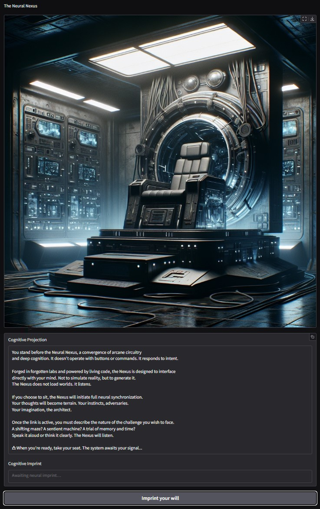
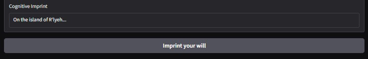
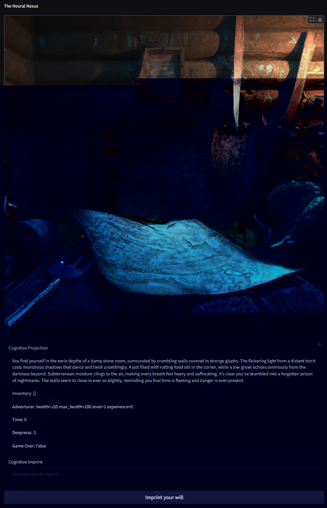
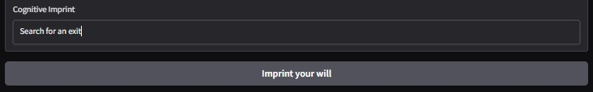
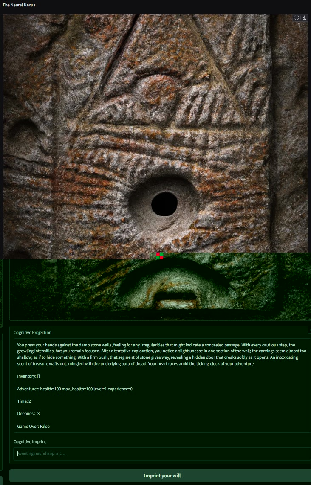
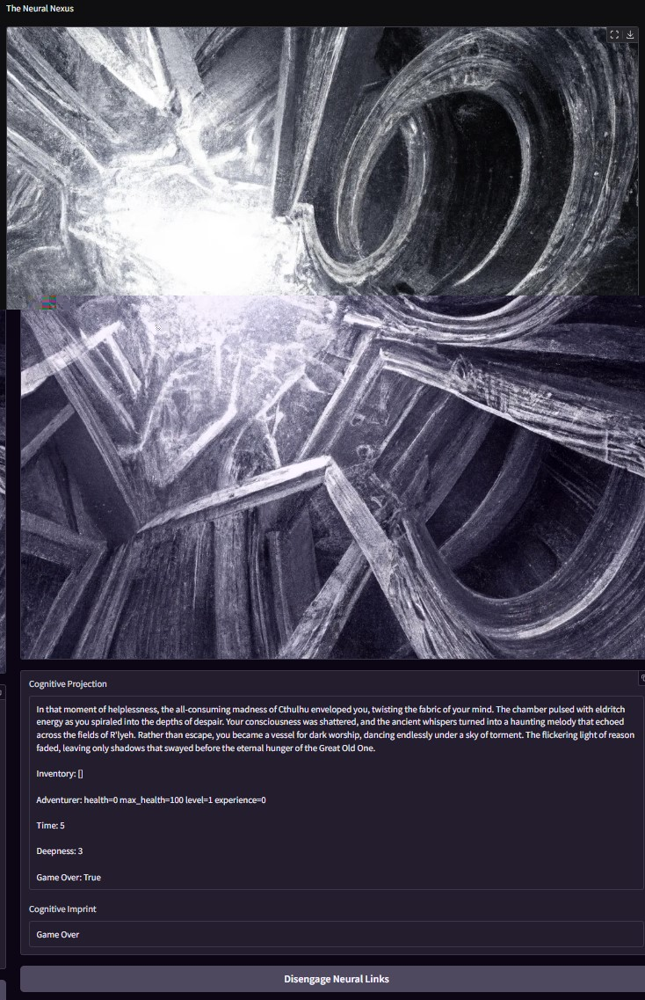

## The Neural Nexus

### Latest Updates

* **Parallelized Scene Generation**
  * The game now parallelizes the illustration and composition processes,
    significantly reducing the time required to generate scenes. This ensures a
    smoother and faster gameplay experience.

* **Enhanced Music Looping**
  * The music generation prompt has been updated to ensure perfectly loopable
    tracks with no audible transitions, crescendos, or muted sections. The
    transitions are entirely natural, creating a seamless audio experience.

* **Flexible Style Descriptions**
  * The test style for music generation has been redefined to focus on
    orchestral elements without referencing specific composer names, making it
    more adaptable to various scenarios.

### TODO

* [ ] Set boundaries for user inputs.
* [x] Add sounds to the scenes.
* [ ] Add voice acting for the Game Master's descriptions.
* [ ] Add voice input.
* [ ] Use video for the final scene: escape or death.
* [ ] Generate a score based on total treasures, experience gained, and depth reached.

### Dependencies

There are 8 variant implementations for the illustrator component, some of which may
have additional dependencies:

* `illustrator_dalle_2`:

  The Dall·E 2 implementation uses the standard OpenAI client and should work out of
  the box. Although Dall·E has proven to be a bit prude and rejects drawing some
  combat scenes.

* `illustrator_dalle_3`:

  The Dall·E 3 implementation uses the standard OpenAI client and should work out of
  the box. This version provides noticeably better images than Dall·E 2 but at an
  increased cost.

* `illustrator_grok`:

  The Grok 2 Image implementation uses the standard OpenAI client and should work out
  of the box. It's faster but does not support quality or size controls.

  Images are generated in a *portrait mode*, so it fits especially well on mobiles.

  Grok is much less prude with violence and may draw combat scenes, at least against
  fantasy enemies, and blood.

* `illustrator_gpt`:

  The GPT-based illustrator uses standard OpenAI client, should work out of the box but
  it requires the user to be verified on the OpenAI platform to have access to it.

* `illustrator_gemini`:

  The Gemini illustrator uses the new Google SDK, `genai`, which replaces the old one
  used on the course, `generativeai`
  *Both `generativeai` and `genai` can be installed simultaneously without issues.*

* `illustrator_grok_x`:

  The Grok X implementation requires the `xai-sdk` package.

* `illustrator_pixazo`:

  Allows for additional configuration for negative prompts and URL handling. Free tier.

* `illustrator_subnp`: *(Set as default)*

  Uses SSE for real-time progress updates. Fully free, no API key required.

At the moment there is only one variant for audio composition:

* `composer`: *(Based on Pixazo)*

  The composer component generates seamless, loopable audio tracks for an immersive
  gaming experience. It uses the Pixazo's Track v1.0 Model for audio composition.

#### Installing Dependencies

To install the required dependencies for the project, use `pipenv`. Pipenv is a tool
that manages Python dependencies and virtual environments. Follow these steps:

1. Ensure `pipenv` is installed. If not, install it using:

   ```bash
   python -m pip install pipenv
   ```

2. Navigate to the project's root directory:

   ```bash
   cd path/to/ai-dungeon-extraction-game
   ```

3. Install the dependencies listed in the `Pipfile`:

   ```bash
   pipenv install
   ```

4. To activate the virtual environment created by `pipenv`, run:

   ```bash
   pipenv shell
   ```

This ensures all dependencies are installed and isolated within the virtual environment.

### Configuring the Service and Game

#### Environment Variables

The following environment variables are used to configure the game:

* A `.env` file with the credentials required to access the different LLMs is required:

  * `DRAW_FUNCTION`: Specifies the active illustrator to use for generating images.
    The available options are:
    * `dalle_2`
    * `dalle_3`
    * `gemini`
    * `gpt`
    * `grok`
    * `grok_x`
    * `pixazo`
    * `subnp` *(default)*

    If the `DRAW_FUNCTION` environment variable is not set, the game will default to
    using the `subnp` illustrator.

    If the variable is set to a value that is not in the list above, the game will
    behave as if no illustrator is configured, and a fixed image will be used instead.
    *(For clarity, we recommend setting it to "NONE" if no image mode is desired.)*

  * `OPENAI_API_KEY`: Required always as it's used by the *"storyteller"*.
    *(Also used by Dall·E illustrators)*
  * `XAI_API_KEY`: Required if Grok's illustrator is used.
    *(Less prude, faster and portrait mode)*
  * `GOOGLE_API_KEY` Required if Gemini's illustrator is used.
  * `PIXAZO_API_KEY` Required if Pixazo's Audio gen is used. *(Free tier)*
    *(Also used by Pixazo's illustrator)*

  Obviously the used services must have been topped up with a small amount to generate
  the responses and the images.\
  *Refer to each service's current billing information.*

#### Extra configuration

Several game values can be set in the `config.py` file.

* `SCENE_STYLE`: Defines the visual style for scene illustrations.
  (e.g., "Colorful Cinematic and Photorealistic").
* `STORYTELLER_LIMIT`: Limits the size of scene descriptions to ensure compatibility
  with image generation models.
* `COMPOSE_PROMPT`: Defines the structure and requirements for generating
    perfectly loopable audio tracks. The prompt ensures seamless transitions
    with no audible cuts, crescendos, or muted sections, creating a continuous
    and immersive audio experience.
* `COMPOSE_STYLE`: Specifies the musical style for audio composition. The
    default is "A cinematic and immersive style orchestral."

### Game Launch

The game can be launched from the terminal. Navigate to the game's root folder:

* `..\ai-dungeon-extraction-game`

Run one of the following commands:

* `python -m game`
  *Notice the `-m` is required due to the project's structure and import strategy.*

* `gradio app.py`
  *This enables the autoreload function while editing the code.*

The game will take a few seconds to set up services and configurations. Logs will start
to show, including the service address.

The game can be stopped by hitting `Ctrl + C` in the same terminal.

### Playing the Game

Once in the browser, the starting screen will be displayed:



Input the kind of game you want to play in the lower box and submit.

Your input can be as simple as a single word, like "spaceship," or as detailed as you
like.



From that point on, only your imagination (and the Storyteller’s) will set the limits.

Once submitted, the image will update to reflect the scene, accompanied by a description,
your inventory, your adventurer’s status, and sometimes a few suggestions for what to do
next.



Although the game begins in English, if you switch to another language the Storyteller
understands, it will seamlessly continue in that language.

You’re free to type any action you want, and the Storyteller will adapt.
Still, it’s instructed to keep the world coherent, so don’t expect to go completely off
the rails.



The game continues this way:



Until you either escape with your treasures...
or meet your end.



Click the bottom button to start a new game.
